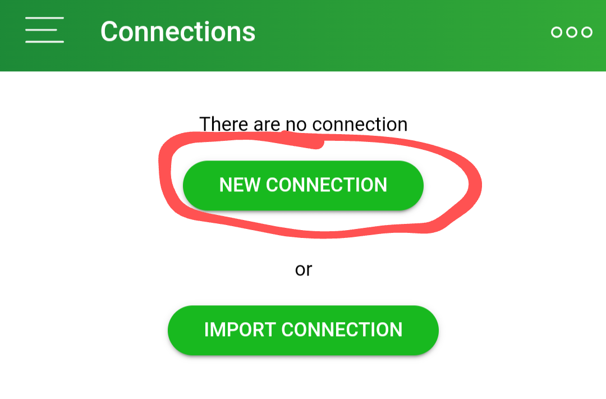
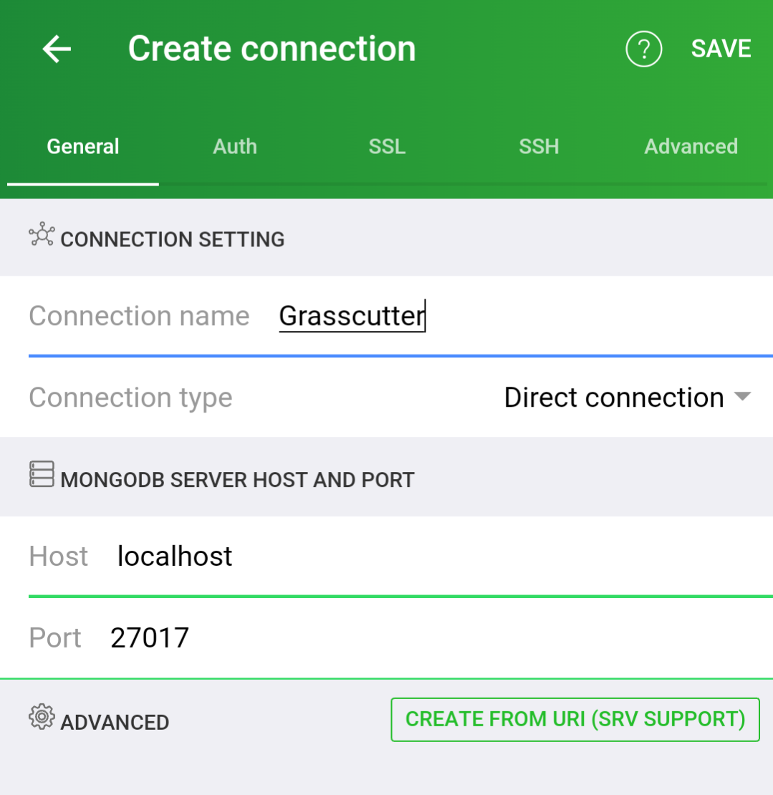
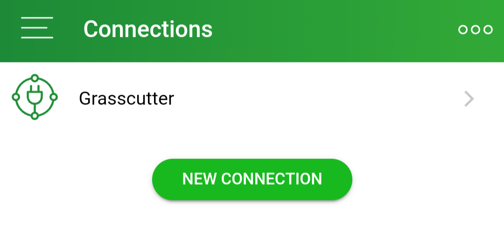
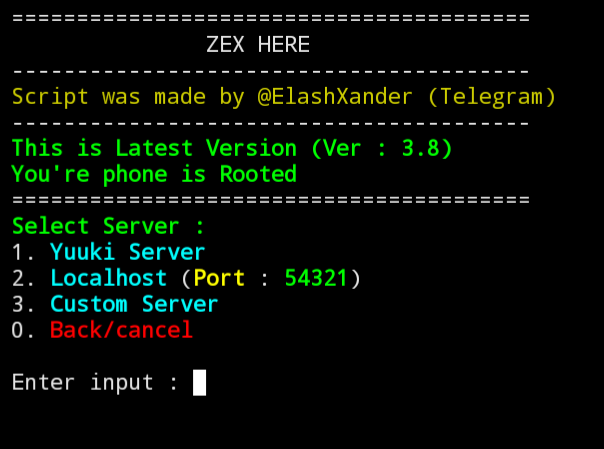

<p align="center">
    
</p>

# GCAndroid

Project is free to use. If you bought it from someone, please refund\
If I see someone selling GCAndroid, I will close the source code (or private)\
Open source code will then only be available to those who are affiliated with [TheScore Inc](https://github.com/Score-Inc)

# About

What are the benefits I can get by hosting a localhost server using GCAndroid?
* Lower ping
* Access to edit server code (Banner, event, abyss, plugin, etc)
* And much more.

## Note

GCAndroid requires [Ubuntu](https://ubuntu.com), [Termux](https://termux.dev/en/) and `SKILL`.\
Running this may burn your phone depending on the device you're using, so it's not recommended to run this on a low-end device.\
But, who knows, maybe you can XD

## Download

Download [Termux F-Droid](https://f-droid.org/repo/com.termux_118.apk) [RECOMMENDED]\
OR\
Download [Termux Android 12+](https://github.com/HardcodedCat/termux-monet) (NEEDS ROOT OR ADB)

## Setup

Note: All commands are executed inside Termux

1. To install proot-distro/ubuntu, run this command:
```bash
pkg update -y && pkg install proot-distro -y && proot-distro install ubuntu
```
2. To login or enter Ubuntu mode, run this command:
```bash
proot-distro login ubuntu
```
3. To install MongoDB, run this command:
```bash
apts=$(cat /etc/apt/sources.list); echo -e "$apts\ndeb http://ports.ubuntu.com/ubuntu-ports/ focal main restricted\ndeb http://ports.ubuntu.com/ubuntu-ports/ focal-updates main restricted\ndeb http://ports.ubuntu.com/ubuntu-ports/ focal universe" > /etc/apt/sources.list && apt update && apt install sudo
```
4. Next is [installation](https://github.com/Score-Inc/GCAndroid#install).


## Installation

### Script

To download GCAndroid, run this command (ONCE ONLY!)
```bash
bash <(curl -s https://raw.githubusercontent.com/Score-Inc/GCAndroid/main/install.sh)
```
* If you would like to run it next time, use this command instead:
```bash
gcandroid
```

## Edit MongoDB Database

Note: All commands are executed inside Termux

To edit the MongoDB database, use [this app](https://play.google.com/store/apps/details?id=com.mongolime.app)\
If you don't have money to buy the app, you can search for a different app/apk or search for a cracked (pirated..) version of the app...

To edit the MongoDB database, make sure the service has started.
To start MongoDB, run this command:
```bash
sudo service mongodb start
```

1. Open the app
2. Press/click on "New Connection"\
<br />
3. You can set the name to "Grasscutter", like in this photo\
<br />\
Don't change anything unless you're going to change the port in MongoDB. Then save the connection.
4. Click on "Grasscutter" (or whatever you called the new connection)\
<br />
5. Done! You can edit the Database, if you want to.


## Playing

### Chinese APK

Termux is required for this.\
You can make your own Private DNS to redirect to localhost.\
And don't ask me, idk how lol\
You can play without a Private DNS or Termux, but it needs Root/SuperUser access.\
Do not ask me how to root, go to [XDA](https://www.xda-developers.com/) to find out how to root.

### Termux/mitmproxy

You may use [my script](https://github.com/Score-Inc/AnimeGamePatch) for this. To change it, enter the number `3`
<br />
Or you can manually edit it with
`nano proxy_config.py`

Change `REMOTE_HOST` to `127.0.0.1`\
Change `REMOTE_PORT` to `54321`
