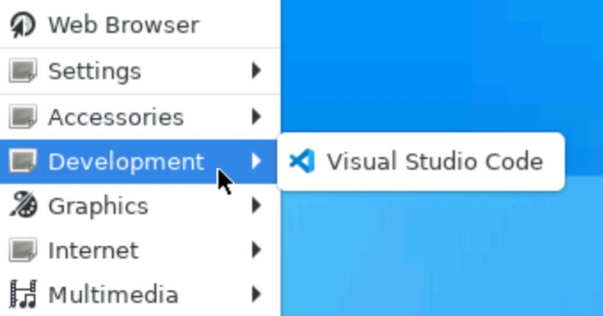
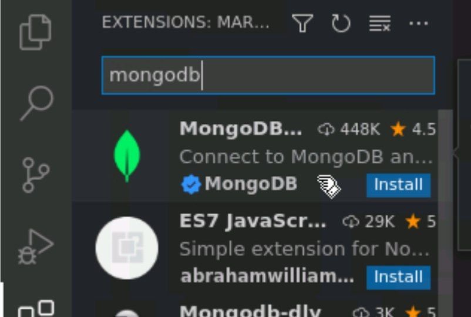
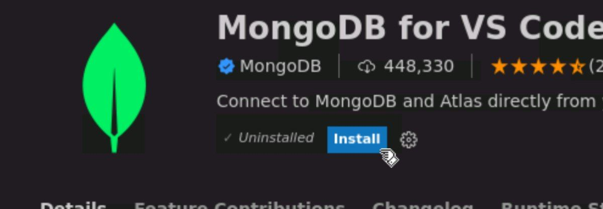
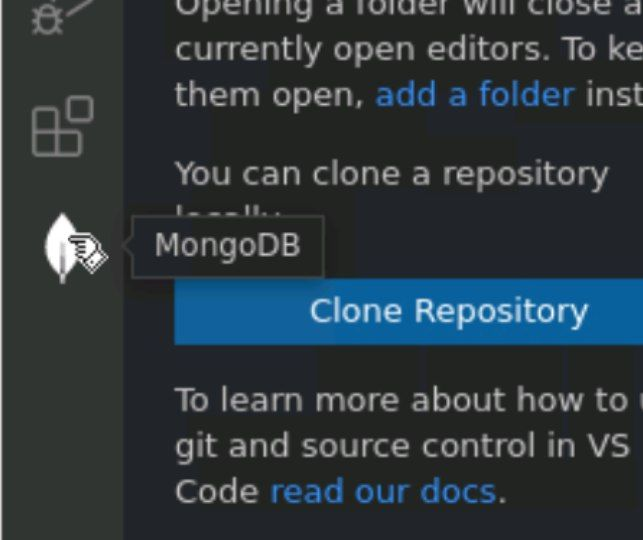
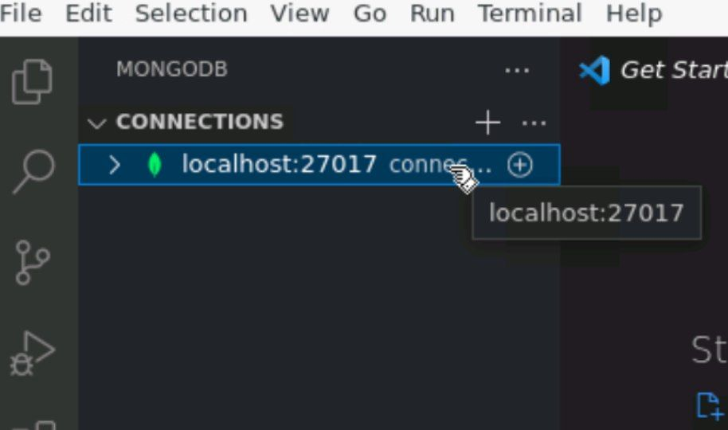
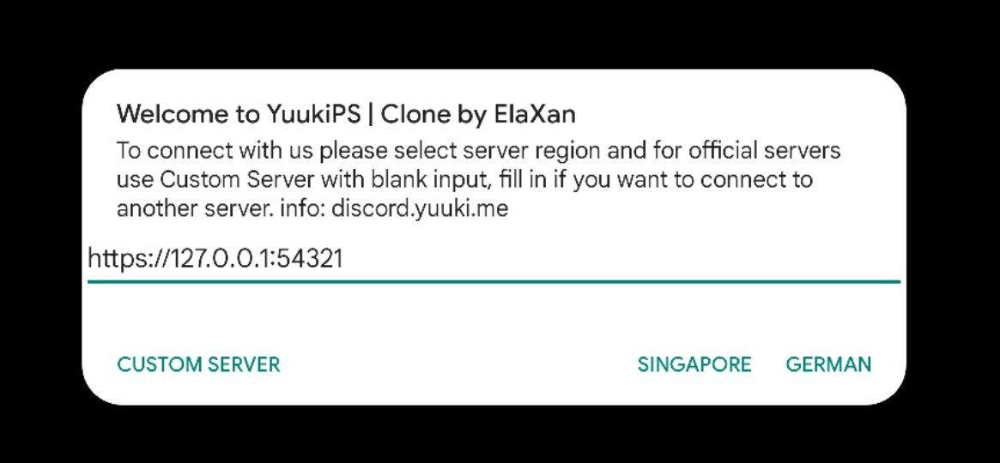
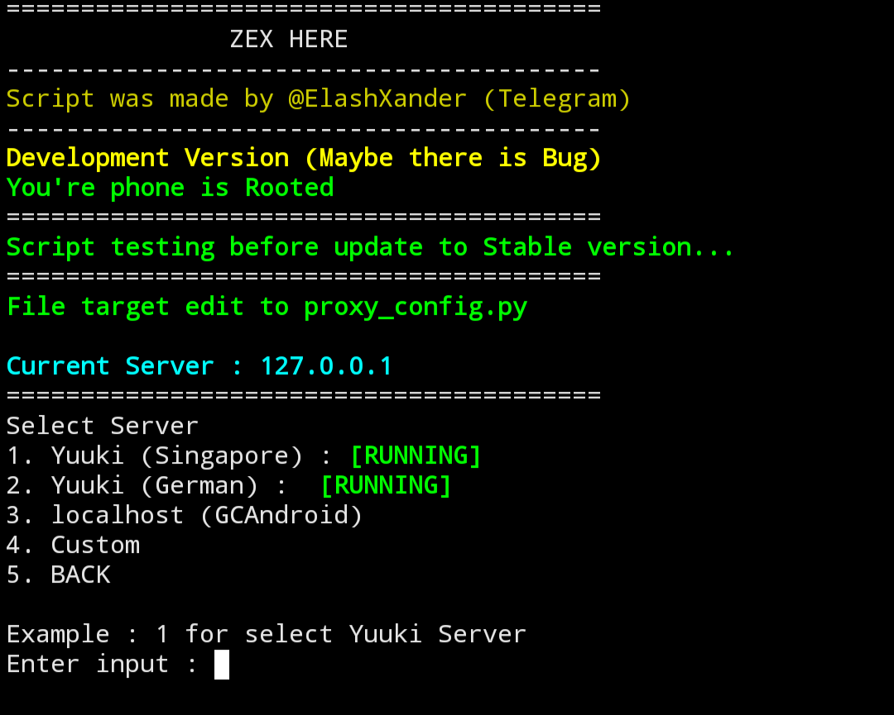

# GCAndroid
What can do if Localhost?
* Lowest Ping
* Can edit the Code (Banner, Event, Abyss, and etc)
* Much you can do
## Note
This need [Ubuntu](https://ubuntu.com), [Termux](https://termux.dev/en/) and `Skillssss`. And this burdens your phone, so it's not recommended for low specs\
But, why not to try it... May i wrong XD

## Download
Download [Termux F-Droid](https://f-droid.org/repo/com.termux_118.apk)\
Download [Andronix](https://play.google.com/store/apps/details?id=studio.com.techriz.andronix)

## Setup
Open [Andronix](https://play.google.com/store/apps/details?id=studio.com.techriz.andronix)
1. Select Ubuntu Icon
2. Click on "Proceed"
3. Select "20.04"
4. Select "Install"
5. Select "Desktop Environment"
6. Select "XFCE"
7. Click "Open Termux"
8. And paste on Termux then Enter on your Keyboard
* This need long time to install depends with your Internet
* Don't close or kill Termux, if you do that then some program/package not install
* If in Termux became like this `root@localhost:~#` then do [next step](https://github.com/ElaXan/GCAndroid#install)

## Install
### Mongodb
If you already [setup](https://github.com/ElaXan/GCAndroid#setup) then now install mongodb
Copy this and paste to Termux
```bash
sudo apt-get update -y && sudo apt-get install mongodb curl -y
```
After success install mongodb and run it using this command
```bash
sudo service mongodb start
```
If want stop copy this and paste to Termux
```bash
pkill mongo && sudo service mongodb stop
```

### Grasscutter
Install Grasscutter already moved to [Script](https://github.com/ElaXan/GCAndroid#script)

### Script
Copy this and paste to Termux
[ONLY ONE TIME]
```bash
bash <(curl -s https://raw.githubusercontent.com/ElaXan/GCAndroid/main/install.sh)
```
* If you want use that again just enter this command
```bash
gcandroid
```

## Edit Mongodb Database
Q. How to edit mongodb database??\
A. You can using Visual Studio Code for edit database\
Copy this and paste to Termux
```bash
wget https://az764295.vo.msecnd.net/stable/e4503b30fc78200f846c62cf8091b76ff5547662/code_1.70.2-1660628199_arm64.deb && sudo apt install libsecret-1-0 && sudo dpkg -i code_1.70.0-1659587966_arm64.deb && sudo sed -i "s/code --unity-launch %F/code --no-sandbox --unity-launch %F/g" /usr/share/applications/code.desktop
```
* Enter command `vncserver` on Termux then open [VNCViewer](https://play.google.com/store/apps/details?id=com.realvnc.viewer.android)
* Click on "+" bottom right
* Enter Address : **localhost:5901**
* Name : || whatever you want ||
* Enter password when you install [Ubuntu](https://github.com/ElaXan/GCAndroid#setup)
1. Click on Application on Top Left
2. Open Visual Studio Code\
<br />
3. Go to extension and search `mongodb`\
<br />
4. `install` mongodb\
<br />
5. Close `Visual Studio Code` and open it again same like number 1<br />
6. Click `mongodb icon` on bottom extension\
<br />
7. Just click it and Done now you can edit Database `mongodb`\
<br />
[YOU NEED TO TURN ON OR RUN `MONGODB` FOR CONNECT TO VISUAL STUDIO CODE]

## Play
### YuukiProxy
Enter address : `https://127.0.0.1:54321` like this picture\
<br />
Then click `Custom Server`

### Termux/mitmproxy
You can using [my script](https://github.com/ElaXan/AnimeGamePatch) for change it enter number `3`\
<br />
Or you can manual edit with\
`nano proxy_config.py`\
Change in `REMOTE_HOST` to **127.0.0.1**\
Change in `REMOTE_PORT` to **54321**
